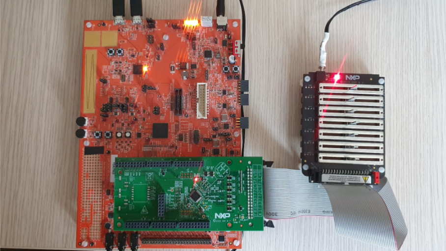
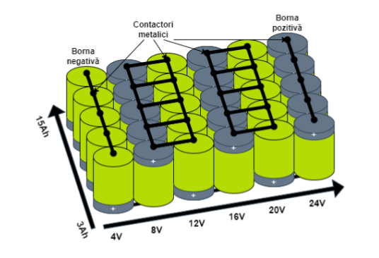
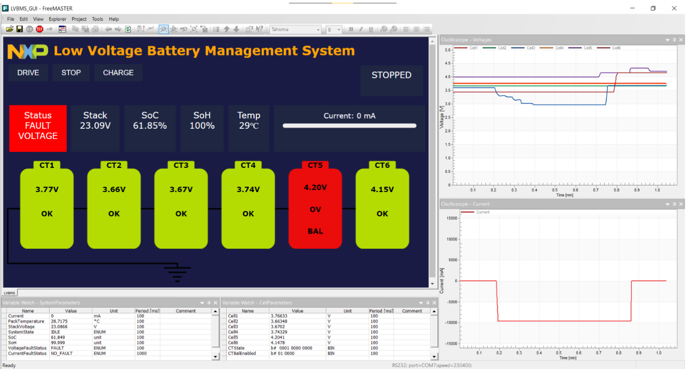

## BATTERY MONITORING SYSTEM FOR LOW VOLTAGE APPLICATIONS

### Project Objectives

The purpose of the project was to develop a monitoring and management system for applications using low-voltage Li-Ion batteries. To achieve this requirement, components provided by NXP Semiconductors were used, namely the S32K344 microcontroller and the MC33772C device integrated into the system shown in Figure 1. For this purpose, the following were implemented:

- Driver that handles communication between the microcontroller and the BCC (Battery Cell Controller) device through the SPI interface
- LVBMS (Low Voltage Battery Management System) application that performs the main cell monitoring and control functions
- Graphical application created using the FreeMASTER environment that connects to the system through the integrated USB port where conversion to UART protocol is performed

In Figure 1, the three main HW components that make up the developed system can be observed. The orange board is the S32K3X4EVB-Q257 development board containing the S32K344 microcontroller, the green board is the FRDM33772CSPEVB development board containing the MC33772C integrated circuit in SPI variant, and the last component is the BATT6-EMULATOR battery emulator.

### Project Implementation and Results Obtained

To demonstrate the system functionality, a battery emulator was used that allows variation of 6 voltages in the range 1.25V : 4.8V, and one voltage in the range −150mV : 150mV. The 6 potentiometers of the emulator will simulate the voltages of Li-Ion cells, and the last one will simulate the voltage drop across a shunt resistor with a value of 10mΩ. The last potentiometer is used to simulate the current of the entire battery in the range −15A : 15A.

BMS systems are systems specially developed for a specific application, which is why the LVBMS system was designed for monitoring the cells of a 24V battery with a capacity of 15Ah for an electric scooter. The battery of this scooter consists of 30 SAMSUNG 30Q INR18650 accumulators electrically connected to develop the mentioned voltage and capacity. Knowing the voltage of a cell charged approximately 80% (4V) and its capacity (3000mAh), it is necessary to connect in series 6 levels of 5 accumulators connected in parallel, as illustrated in Figure 2. Since the cells are connected in parallel, monitoring the 6 potentials is sufficient.

The LVBMS application starts and processes voltage, current and temperature measurements, implements the algorithm for determining the state of charge using the OCV - SoC (Open Circuit Voltage - State of Charge) variation curve and the coulomb counting method, estimates the state of health, performs cell voltage balancing, identifies the source of faults and prevents cell deterioration by disconnecting the battery from the load.

The developed system communicates with the diagnostic application created in the FreeMASTER environment. This has a user-friendly graphical interface (Figure 3) that facilitates analysis of battery parameters.

The parameters that can be observed in the graphical interface are battery status, its voltage, state of charge and health, temperature, current and individual cell voltages. The cell status is also illustrated, indicating whether the cell is being balanced or is the source of a fault if applicable. To simulate the operation of an electric scooter, buttons have been added that control the system status. Thus, it can be simulated whether the scooter is started, stopped or charging, with LVBMS acting accordingly in dangerous situations.

Through the presented software components, I contributed to the development of the BMS SDK software package offered by NXP Semiconductors. The implemented Bms Spiif driver allows, starting with version 1.0.0 of the package, the use of BMS solutions for low voltage applications, and the LVBMS application represents the software reference that can be used by companies interested in using the presented components. The evaluation process of the MC33772C integrated circuit is reduced thanks to the graphical application that allows evaluation of its capabilities graphically.

## Key Features

- **Hardware Components:**
  - S32K344 microcontroller
  - MC33772C Battery Cell Controller
  - BATT6-EMULATOR for testing

- **Software Components:**
  - SPI communication driver
  - LVBMS monitoring application
  - FreeMASTER graphical interface

- **Monitoring Capabilities:**
  - Individual cell voltage monitoring (6 cells)
  - Current measurement (±15A range)
  - Temperature monitoring
  - State of Charge (SoC) estimation
  - State of Health (SoH) estimation
  - Cell balancing
  - Fault detection and protection

- **Target Application:**
  - 24V, 15Ah electric scooter battery
  - 30 SAMSUNG 30Q INR18650 cells
  - 6S5P configuration (6 series, 5 parallel)

- **Communication:**
  - SPI interface between microcontroller and BCC
  - USB to UART conversion for PC communication
  - FreeMASTER diagnostic interface
